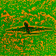
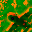
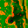
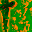

# DeepLearning
## DeepLearning Assignment2
---
## Paths at aws instance
```
+-- ds-ga-1008-a2
|   +-- logs/ <-- models and report are here
|   +-- models/
|   +-- train.lua
|   +-- provider.lua
+-- peterSpace <-- where my work space
```

---
## Baseline model


---
## Create Surrogate sample
```
th -i surrogate.lua
```
The idea is get all figure normalized first, and then perform rotate, translate, and scale with random degree in the range as the paper mentioned.
Code are mainly [here](https://github.com/jfriend08/DeepLearning/blob/master/assignment2/src/surrogate.lua#L99)
```
Surrogate = Surrogate()
Surrogate:normalize()
Surrogate:getSurrogate(numFig)
torch.save('Surrogate.t7',Surrogate)
```
So this way we can load Surrogate.t7 and call `Surrogate.surrogateData.data:float()` and `Surrogate.surrogateData.labels:float()`

Original figure:


After :



---
## Way to train surrogate data
Was tring to follow the structure of this [paper](http://arxiv.org/pdf/1406.6909.pdf).
Now the structure is mainly for 64c5-128c5-256c5-512f-4000f, code is [here](https://github.com/jfriend08/DeepLearning/blob/dev/assignment2/src/models/surroTrainII.lua#L5)
To start the training on surrogate data:
```
th surroTrain.lua --model surroTrainII  -s logs/surro -numClasses 4000
```


