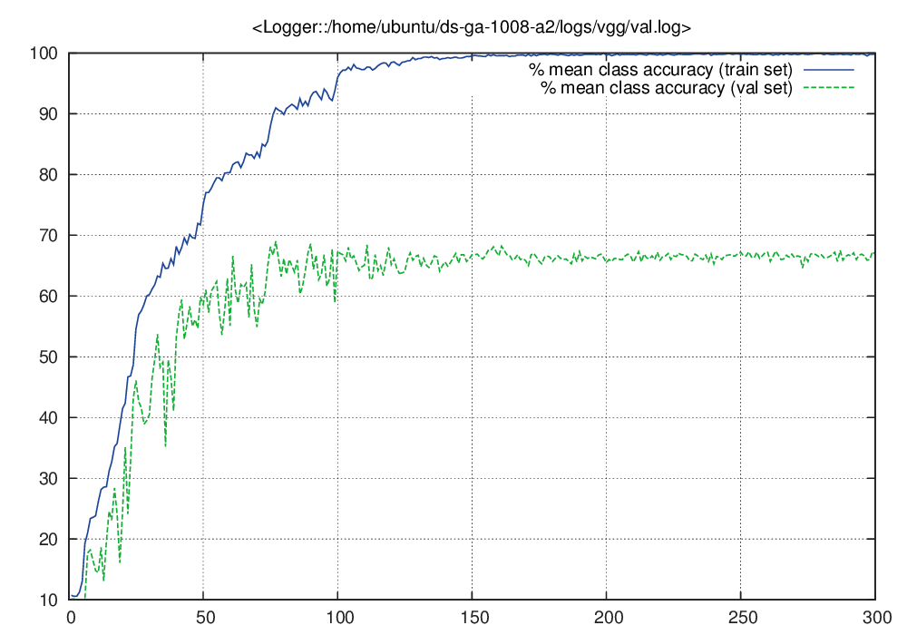

# DeepLearning
## DeepLearning Assignment2
---
## Paths at aws instance
```
+-- ds-ga-1008-a2
|   +-- logs/ <-- models and report are here
|   +-- models/
|   +-- train.lua
|   +-- provider.lua
+-- peterSpace <-- where my work space
```

---
## Baseline model


---
## Create Surrogate sample
```
th -i surrogate.lua
```
The idea is get all figure normalized first, and then perform rotate, translate, and scale with random degree in the range as the paper mentioned.
Code are mainly [here](https://github.com/jfriend08/DeepLearning/blob/master/assignment2/src/surrogate.lua#L99)
```
Surrogate = Surrogate()
Surrogate:normalize()
Surrogate:getSurrogate(numFig)
torch.save('Surrogate.t7',Surrogate)
```
So this way we can load Surrogate.t7 and call `Surrogate.surrogateData.data:float()` and `Surrogate.surrogateData.labels:float()`